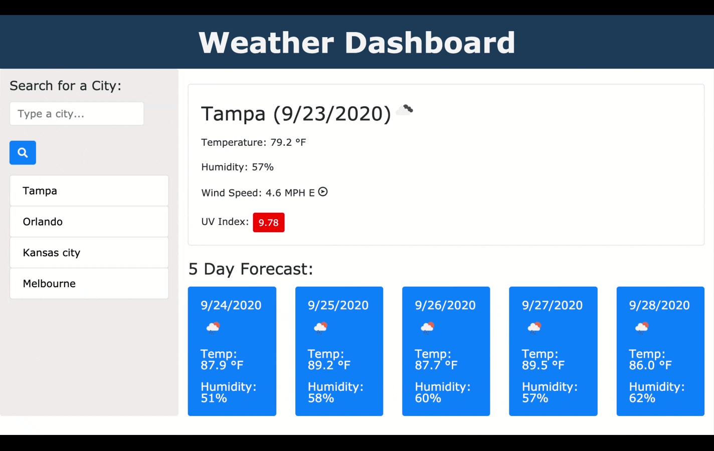

# weather-dashboard
   

A simple dashboard application that allows the user to view weather information for a specific city.

https://katiec2116.github.io/weather-dashboard/

## Overview

This is a weather dashboard application that runs in the browser and features dynamically updated HTML and CSS powered by JavaScript, jQuery, and Moment. It features a clean and polished user interface and will store recently viewed cities in local storage. The app will display the last searched city on load or, if none have been serched, the screen will tell the user to search for a city. 

## Features

## License

MIT

## Tests

No tests available

## Questions?

You can reach me at katiecampbell21@outlook.com

---

